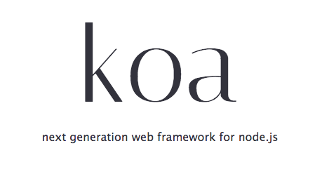

A collection of simple demos of [Koa](http://koajs.com/), a web application framework for Node.



## How to use

First of all, check your Node version.

```bash
$ node -v
v8.0.0
```

Koa requires node v7.6.0+. If your version is older than that, upgrade Node first.

Then clone the repo (or download [zip file](https://github.com/ruanyf/koa-demos/archive/master.zip)).

```bash
$ git clone git@github.com:ruanyf/koa-demos.git
```

Install the dependencies.

```bash
$ cd koa-demos
$ npm install
```

Now play with the [source files](https://github.com/ruanyf/koa-demos/tree/master/demos) under the demos directory.

## Index

1. Basics
    - [Start a server](#demo01-start-a-server)
    - [Hello World](#demo02-hello-world)
    - [Response type](#demo03-response-type)
    - [Use a template](#demo04-use-a-template)
1. Router
    - [Simple router](#demo05-simple-router)
    - [Koa-route](#demo06-koa-route)
    - [Static assets](#demo12-static-assets)
    - [Response redirecting](#demo13-response-redirecting)
1. Middleware
    - [Logger](#demo07-logger)
    - [Middleware](#demo08-middleware)
    - [Middleware stack](#demo09-middleware-stack)
    - [Async middleware](#demo10-async-middleware)
    - [Compose multi middlewares](#demo11-compose-multi-middlewares)
1. Error handling
    - [500 error](#demo14-500-error)
    - [404 error](#demo15-404-error)
    - [Error handling](#demo16-error-handling)
    - [Error listener](#demo17-error-listener)
    - [Error emitting](#demo18-error-emitting)
1. Web app
    - [Cookies](#demo19-cookies)
    - [Form](#demo20-form)
    - [Upload](#demo21-upload)

## Demo01: start a server

Starting a server with Koa is very easy. Only 3 lines.

```javascript
// demos/01.js
const Koa = require('koa');
const app = new Koa();

app.listen(3000);
```

Run the demo.

```bash
$ node demos/01.js
```

Visit http://127.0.0.1:3000 . You should see nothing but 'Not Found' in the page, since we haven't add any content.

## Demo02: Hello World

Koa provides a Context object encapsulating HTTP request and response.

> - `context.request`: a Request object, representing as the incoming http message.
> - `context.response`: a Response object, representing the corresponding response to that message.

`Context.response.body` is the data responsing to the visitor.

```javascript
// demos/02.js
const Koa = require('koa');
const app = new Koa();

const main = ctx => {
  ctx.response.body = 'Hello World';
};

app.use(main);
app.listen(3000);
```

Run the demo.

```bash
$ node demos/02.js
```

Visit http://127.0.0.1:3000 . Now you should see 'Hello World' in the page.

## Demo03: response type

`ctx.request.accepts` checks HTTP request head's `Accept` field. According to the client's accept preference, server could send out responses of different types.

```javascript
// demos/03.js
const Koa = require('koa');
const app = new Koa();

const main = ctx => {
  if (ctx.request.accepts('xml')) {
    ctx.response.type = 'xml';
    ctx.response.body = '<data>Hello World</data>';
  } else if (ctx.request.accepts('json')) {
    ctx.response.type = 'json';
    ctx.response.body = { data: 'Hello World' };
  } else if (ctx.request.accepts('html')) {
    ctx.response.type = 'html';
    ctx.response.body = '<p>Hello World</p>';
  } else {
    ctx.response.type = 'text';
    ctx.response.body = 'Hello World';
  }
};

app.use(main);
app.listen(3000);
```

Run the demo.

```bash
$ node demos/03.js
```

Visit http://127.0.0.1:3000 . What you see depends on the `Accept` field of HTTP request header. In most cases, the content will be a XML document.

## Demo04: use a template

A template file could be used as the response sending to the client.

```javascript
// demos/04.js
const fs = require('fs');
const Koa = require('koa');
const app = new Koa();

const main = ctx => {
  ctx.response.type = 'html';
  ctx.response.body = fs.createReadStream('./demos/template.html');
};

app.use(main);
app.listen(3000);
```

Run the demo.

```bash
$ node demos/04.js
```

Visit http://127.0.0.1:3000 . You will see the content of the template file.

## Demo05: simple router

`ctx.request.path` is the requestd path. We could use it to implement a simple router.

```javascript
// demos/05.js
const Koa = require('koa');
const app = new Koa();

const main = ctx => {
  if (ctx.request.path !== '/') {
    ctx.response.type = 'html';
    ctx.response.body = '<a href="/">Index Page</a>';
  } else {
    ctx.response.body = 'Hello World';
  }
};

app.use(main);
app.listen(3000);
```

Run the demo.

```bash
$ node demos/05.js
```

Visit http://127.0.0.1:3000/about . You could click the link to the Index page.

## Demo06: koa-route

[`koa-route`](https://www.npmjs.com/package/koa-route) package is a more elegant and useful way to implement the router functionality.

```javascript
// demos/06.js
const Koa = require('koa');
const route = require('koa-route');
const app = new Koa();

const about = ctx => {
  ctx.response.type = 'html';
  ctx.response.body = '<a href="/">Index Page</a>';
};

const main = ctx => {
  ctx.response.body = 'Hello World';
};

app.use(route.get('/', main));
app.use(route.get('/about', about));

app.listen(3000);
```

Run the demo.

```bash
$ node demos/06.js
```

Visit http://127.0.0.1:3000/about . You could click the link to the Index page.

## Demo07: logger

Logging is easy. Adding a line into the `main` function.

```javascript
// demos/07.js
const Koa = require('koa');
const app = new Koa();

const main = ctx => {
  console.log(`${Date.now()} ${ctx.request.method} ${ctx.request.url}`);
  ctx.response.body = 'Hello World';
};

app.use(main);
app.listen(3000);
```

Run the demo.

```bash
$ node demos/07.js
```

Visit http://127.0.0.1:3000 . You will see the logging info in console.

## Demo08: middleware

The logger in the previous demo could be taken out as a separate function which we call it a middleware. Because a middleware is like a middle layer between HTTP request and HTTP response to process the data.

```javascript
// demos/08.js
const Koa = require('koa');
const app = new Koa();

const logger = (ctx, next) => {
  console.log(`${Date.now()} ${ctx.request.method} ${ctx.request.url}`);
  next();
}

const main = ctx => {
  ctx.response.body = 'Hello World';
};

app.use(logger);
app.use(main);
app.listen(3000);
```

Each middleware receives a Koa Context object and a `next` function as parameters. Calling `next` function will pass the execution to the next middleware.

`app.use()` is used to load middlewares. All functionalities in Koa are achieved by middlewares.

Run the demo.

```bash
$ node demos/08.js
```

Visit http://127.0.0.1:3000 . You will see the logging info in console.

## Demo09: middleware stack

Multi middlewares form a middle stack. The most outer middleware is executed first, then passes the execution to the next middleware. And the most inner middleware is executed last, then returns the execution to the previous middleware. It is just like a first-in-last-out stack.

```javascript
// demos/09.js
const Koa = require('koa');
const app = new Koa();

const one = (ctx, next) => {
  console.log('>> one');
  next();
  console.log('<< one');
}

const two = (ctx, next) => {
  console.log('>> two');
  next();
  console.log('<< two');
}

const three = (ctx, next) => {
  console.log('>> three');
  next();
  console.log('<< three');
}

app.use(one);
app.use(two);
app.use(three);

app.listen(3000);
```

Run the demo.

```bash
$ node demos/09.js
```

Visit http://127.0.0.1:3000 . You will see the following result in console.

```bash
>> one
>> two
>> three
<< three
<< two
<< one
```

As a exercise, commenting the line of `next()` in the middleware `two`, you will find the execution will not be passed down.

## Demo10: async middleware

If there are async operations in a middleware, you have to use async middleware, i.e. use a async function as middleware.

```javascript
const fs = require('fs.promised');
const Koa = require('koa');
const app = new Koa();

const main = async function (ctx, next) {
  ctx.response.type = 'html';
  ctx.response.body = await fs.readFile('./demos/template.html', 'utf8');
};

app.use(main);
app.listen(3000);
```

In above codes, `fs.readFile` is a async operation, so you have to write `await fs.readFile()`, then put it in a async function.

Run the demo.

```bash
$ node demos/10.js
```

Visit http://127.0.0.1:3000 . You will see the content of the template file.

## Demo11: compose multi middlewares

[`koa-compose`](https://www.npmjs.com/package/koa-compose) package is used to compose multi middlewares into one.

```javascript
// demos/11.js
const Koa = require('koa');
const compose = require('koa-compose');
const app = new Koa();

const logger = (ctx, next) => {
  console.log(`${Date.now()} ${ctx.request.method} ${ctx.request.url}`);
  next();
}

const main = ctx => {
  ctx.response.body = 'Hello World';
};

const middlewares = compose([logger, main]);

app.use(middlewares);
app.listen(3000);
```

Run the demo.

```bash
$ node demos/11.js
```

Visit http://127.0.0.1:3000 . You will see the logging info in console.

## Demo12: static assets

[`koa-static`](https://www.npmjs.com/package/koa-static) package could be used to serve static assets.

```javascript
// demos/12.js
const Koa = require('koa');
const app = new Koa();
const path = require('path');
const serve = require('koa-static');

const main = serve(path.join(__dirname));

app.use(main);
app.listen(3000);
```

Run the demo.

```bash
$ node demos/12.js
```

Visit http://127.0.0.1:3000/12.js . you will see the above code.

## Demo13: response redirecting

`ctx.response.redirect()` redirects visitor into another page.

```javascript
// demos/13.js
const Koa = require('koa');
const route = require('koa-route');
const app = new Koa();

const redirect = ctx => {
  ctx.response.redirect('/');
  ctx.response.body = '<a href="/">Index Page</a>';
};

const main = ctx => {
  ctx.response.body = 'Hello World';
};

app.use(route.get('/', main));
app.use(route.get('/redirect', redirect));

app.use(main);
app.listen(3000);
```

Run the demo.

```bash
$ node demos/13.js
```

Visit http://127.0.0.1:3000/redirect. The browser will be redirected to the root path.

## Demo14: 500 error

`ctx.throw()` throws an error response (status code 4xx / 5xx) to visitor.

```javascript
// demos/14.js
const Koa = require('koa');
const app = new Koa();

const main = ctx => {
  ctx.throw(500);
};

app.use(main);
app.listen(3000);
```

Run the demo.

```bash
$ node demos/14.js
```

visit http://127.0.0.1:3000. You will see a 500 error page of "Internal Server Error".

## Demo15: 404 error

Setting `ctx.response.status` as 404 has the same effect as `ctx.throw(404)`.

```javascript
const Koa = require('koa');
const app = new Koa();

const main = ctx => {
  ctx.response.status = 404;
  ctx.response.body = 'Page Not Found';
};

app.use(main);
app.listen(3000);
```

Run the demo.

```bash
$ node demos/15.js
```

Visit http://127.0.0.1:3000 . You will see a 404 error page of 'Page Not Found'.

## Demo16: error handling

A error-handling middleware could be put on the top of middleware stack to catch the thrown errors.

```javascript
// demos/16.js
const Koa = require('koa');
const app = new Koa();

const handler = async (ctx, next) => {
  try {
    await next();
  } catch (err) {
    ctx.response.status = err.statusCode || err.status || 500;
    ctx.response.body = {
      message: err.message
    };
  }
};

const main = ctx => {
  ctx.throw(500);
};

app.use(handler);
app.use(main);
app.listen(3000);
```

Run the demo.

```bash
$ node demos/16.js
```

Visit http://127.0.0.1:3000 . You will see a 500 page of `{"message":"Internal Server Error"}`.

## Demo17: error listener

You could listen to `error` event.

```javascript
// demos/17.js
const Koa = require('koa');
const app = new Koa();

const main = ctx => {
  ctx.throw(500);
};

app.on('error', (err, ctx) => {
  console.error('server error', err);
});

app.use(main);
app.listen(3000);
```

Run the demo.

```bash
$ node demos/17.js
```

Visit http://127.0.0.1:3000 . You will see `server error` in the command line console.

## Demo18: error emitting

A error listener does not work under all cases. If an error is caught and not thrown again, it will not be passed to the error listener.

```javascript
// demos/18.js`
const Koa = require('koa');
const app = new Koa();

const handler = async (ctx, next) => {
  try {
    await next();
  } catch (err) {
    ctx.response.status = err.statusCode || err.status || 500;
    ctx.response.type = 'html';
    ctx.response.body = '<p>Something wrong, please contact administrator.</p>';
    ctx.app.emit('error', err, ctx);
  }
};

const main = ctx => {
  ctx.throw(500);
};

app.on('error', function(err) {
  console.log('logging error ', err.message);
  console.log(err);
});

app.use(handler);
app.use(main);
app.listen(3000);
```

In above codes, `ctx.app.emit()` is used to emit an `error` event.

Run the demo.

```bash
$ node demos/18.js
```

Visit http://127.0.0.1:3000 . You will see `logging error ` in the command line console.

## Demo19: cookies

`ctx.cookies` is used to read/write cookies.

```javascript
// demos/19.js
const Koa = require('koa');
const app = new Koa();

const main = function(ctx) {
  const n = Number(ctx.cookies.get('view') || 0) + 1;
  ctx.cookies.set('view', n);
  ctx.response.body = n + ' views';
}

app.use(main);
app.listen(3000);
```

Run the demo.

```bash
$ node demos/19.js
```

Visit http://127.0.0.1:3000 and refresh the page, and you should see `1 views` at first, then `2 views`.

## Demo20: form

[`koa-body`](https://www.npmjs.com/package/koa-body) package is used to parse the body carried by a POST request.

```javascript
// demos/20.js
const Koa = require('koa');
const koaBody = require('koa-body');
const app = new Koa();

const main = async function(ctx) {
  const body = ctx.request.body;
  if (!body.name) ctx.throw(400, '.name required');
  ctx.body = { name: body.name };
};

app.use(koaBody());
app.use(main);
app.listen(3000);
```

Run the demo.

```bash
$ node demos/20.js
```

Open another command line window, and run the following command.

```bash
$ curl -X POST --data "name=Jack" 127.0.0.1:3000
{"name":"Jack"}

$ curl -X POST --data "name" 127.0.0.1:3000
name required
```

## Demo21: upload

[`koa-body`](https://www.npmjs.com/package/koa-body) package could process the upload files as well.

```javascript
// demos/21.js
const os = require('os');
const path = require('path');
const Koa = require('koa');
const fs = require('fs');
const koaBody = require('koa-body');

const app = new Koa();

const main = async function(ctx) {
  const tmpdir = os.tmpdir();
  const filePaths = [];
  const files = ctx.request.body.files || {};

  for (let key in files) {
    const file = files[key];
    const filePath = path.join(tmpdir, file.name);
    const reader = fs.createReadStream(file.path);
    const writer = fs.createWriteStream(filePath);
    reader.pipe(writer);
    filePaths.push(filePath);
  }

  ctx.body = filePaths;
};

app.use(koaBody({ multipart: true }));
app.use(main);
app.listen(3000);
```

Run the demo.

```bash
$ node demos/21.js
```

Open another command line window, and run the following command to upload a file.

```bash
$ curl --form upload=@/path/to/file http://127.0.0.1:3000
["/tmp/file"]
```

## Useful links

- [koa workshop](https://github.com/koajs/workshop)
- [kick-off-koa](https://github.com/koajs/kick-off-koa)
- [Koa Examples](https://github.com/koajs/examples)

